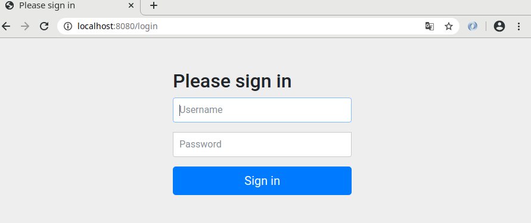

# Spring Boot With Spring Security

Added Spring Security

## 1. Minimal configuration

In pom.xml add the dependency:

```xml
<dependency>
    <groupId>org.springframework.boot</groupId>
    <artifactId>spring-boot-starter-security</artifactId>
</dependency>
```

With this, all routes of the app will be request us to login:



user: user
password: <<the key generated and showed by console in the starting of the application>>

## 2. Configure user and password in application.properties

```properties
spring.security.user.name = user
spring.security.user.password = password
```

## 3. Use a database to authenticate

### 3.1 Implement a security config

This securityConfig will use our custom implementation of UserDetailsService called UserService

```java
package com.example.demoweb;

import com.example.demoweb.service.UserService;
import org.springframework.beans.factory.annotation.Autowired;
import org.springframework.context.annotation.Bean;
import org.springframework.context.annotation.Configuration;
import org.springframework.security.config.annotation.authentication.builders.AuthenticationManagerBuilder;
import org.springframework.security.config.annotation.web.builders.HttpSecurity;
import org.springframework.security.config.annotation.web.configuration.EnableWebSecurity;
import org.springframework.security.config.annotation.web.configuration.WebSecurityConfigurerAdapter;
import org.springframework.security.crypto.bcrypt.BCryptPasswordEncoder;

@Configuration
@EnableWebSecurity
public class SecurityConfig extends WebSecurityConfigurerAdapter {

    @Autowired
    private UserService userDetailsService;

    @Autowired
    private BCryptPasswordEncoder bcrypt;

    @Bean
    public BCryptPasswordEncoder passwordEncoder() {
        BCryptPasswordEncoder bCryptPasswordEncoder = new BCryptPasswordEncoder();
        return bCryptPasswordEncoder;
    }

    // Using users in memory (equivalent to configuration in application.properties

    /*
    @Override
    protected void configure(AuthenticationManagerBuilder auth) throws Exception {
        auth.inMemoryAuthentication()
                .withUser("user")
                    .password("password")
                    .roles("USER")
                    .and()
                .withUser("admin")
                    .password("admin")
                    .roles("USER", "ADMIN");
    }
    */

    @Override
    protected void configure(AuthenticationManagerBuilder auth) throws Exception {
        auth.userDetailsService(userDetailsService).passwordEncoder(bcrypt);
    }

    @Override
    protected void configure(HttpSecurity http) throws Exception {
        http.authorizeRequests()
                .anyRequest()
                .authenticated()
                .and()
                .httpBasic();
    }
}
```

### 3.2 Creates the user model

A simple pojo that will map the model to the database table user

```java
package com.example.demoweb.model;

import javax.persistence.Entity;
import javax.persistence.Id;

@Entity
public class User {

    @Id
    private int id;
    private String name;
    private String password;

    public int getId() {
        return id;
    }

    public void setId(int id) {
        this.id = id;
    }

    public String getName() {
        return name;
    }

    public void setName(String name) {
        this.name = name;
    }

    public String getPassword() {
        return password;
    }

    public void setPassword(String password) {
        this.password = password;
    }

}
``` 

### 3.2 Creates the IUserRepo

Our repository extends JpaRepository and the findByName method

```java
package com.example.demoweb.repo;

import com.example.demoweb.model.User;
import org.springframework.data.jpa.repository.JpaRepository;

public interface IUserRepo extends JpaRepository<User, Integer> {

    User findByName(String name);

}
``` 

## 3.3 Create the UserService called by SecurityConfig

Our implementation implements the UserDetailsService.

We need to implement the loadByUsername method that will call the findByName method in the repository

```java
package com.example.demoweb.service;

import com.example.demoweb.model.User;
import com.example.demoweb.repo.IUserRepo;
import org.springframework.beans.factory.annotation.Autowired;
import org.springframework.security.core.GrantedAuthority;
import org.springframework.security.core.authority.SimpleGrantedAuthority;
import org.springframework.security.core.userdetails.UserDetails;
import org.springframework.security.core.userdetails.UserDetailsService;
import org.springframework.security.core.userdetails.UsernameNotFoundException;
import org.springframework.stereotype.Service;

import java.util.ArrayList;
import java.util.List;

@Service
public class UserService implements UserDetailsService {

    @Autowired
    private IUserRepo repo;

    @Override
    public UserDetails loadUserByUsername(String username) throws UsernameNotFoundException {
        User us = repo.findByName(username);

        List<GrantedAuthority> roles = new ArrayList<>();
        roles.add(new SimpleGrantedAuthority("ADMIN"));

        UserDetails userDet = new org.springframework.security.core.userdetails.User(us.getName(), us.getPassword(), roles);

        return userDet;
    }
}
``` 
